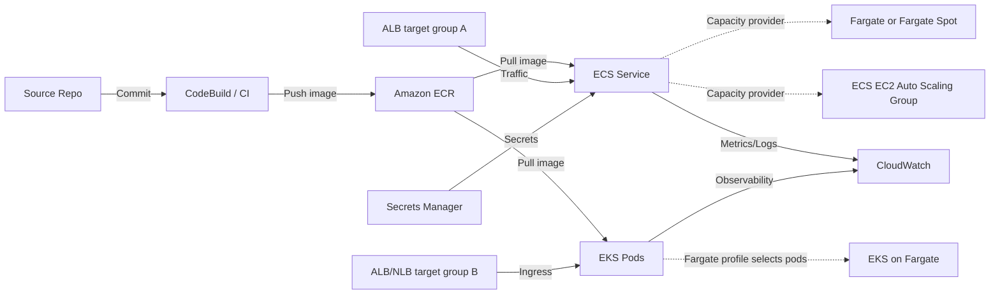

# 10 ECS、EKS、Fargate 容器平台

> 系列：AWS SAP-C02 经典架构（20 场景）
>
> 架构语义已按 AWS 官方资料审计。当前工作区未包含 `aws-sap-c02-529-questions副本.md`，因此题号映射为 **NOT VERIFIED**，不应把代表题号视为已复核事实。

## AWS 架构图

可编辑源图：[10-containers.svg](diagrams/10-containers.svg)

## 核心架构

## 题库反复考的决策

| 判断问题 | 优先架构/服务 | 代表题号 |
|---|---|---|
| 想容器化且最少运维 | ECS + Fargate | Q7、Q63、Q156 |
| 需要 Kubernetes API / ecosystem | EKS；如果还要少管节点可配 Fargate | Q54、Q95、Q127 |
| 变动负载 | ECS Service Auto Scaling / K8s autoscaling | Q68、Q152 |
| 镜像集中管理 | ECR + CI/CD image scanning | Q106、Q303 |

## 架构审计要点

- “Serverless containers”通常指 Fargate，而不是把所有容器改写成 Lambda。
- 如果题目没有明确 Kubernetes 需求，ECS 往往比 EKS 运维开销更低。
- Fargate 是 ECS task 或 EKS pod 的计算模式，不是 ECS/EKS 的下游业务服务；ECS 用 capacity provider，EKS 用 Fargate profile 选择 pod。
- ECS 与 EKS 应作为替代平台分成两条 lane，并分别绑定 target group；EKS Fargate 负载均衡通常使用 IP target。

## 覆盖的代表题

Q7, Q45, Q54, Q63, Q68, Q93, Q94, Q95, Q106, Q117, Q127, Q138, Q146, Q152, Q156, Q175, Q180, Q183, Q187, Q207, Q208, Q223, Q224, Q228, Q271, Q280, Q303, Q333, Q341, Q342, Q346, Q355, Q368, Q422, Q432, Q455, Q474

---

## 系列导航

- 上一篇：[09 Event-Driven 解耦与工作流编排](./09_Event-Driven_解耦与工作流编排.md)
- 系列总览：[01 Organizations 多账户治理与 Landing Zone](./01_Organizations_多账户治理与_Landing_Zone.md)
- 下一篇：[11 数据湖、分析与查询平台](./11_数据湖_分析与查询平台.md)
