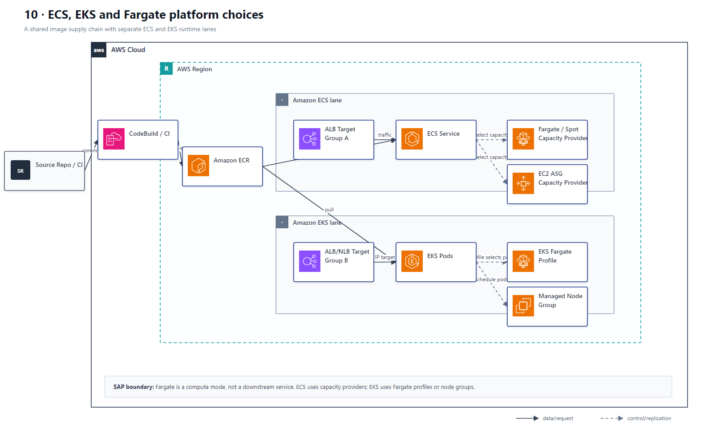

# 10 ECS、EKS、Fargate 容器平台

## AWS 架构图

## 关键架构决策

| 架构需求 | 推荐设计 |
|---|---|
| 想容器化且最少运维 | ECS + Fargate |
| 需要 Kubernetes API / ecosystem | EKS；如果还要少管节点可配 Fargate |
| 变动负载 | ECS Service Auto Scaling / K8s autoscaling |
| 镜像集中管理 | ECR + CI/CD image scanning |

## 架构设计要点

- “Serverless containers”通常指 Fargate，而不是把所有容器改写成 Lambda。
- 如果没有明确的 Kubernetes API 或生态兼容需求，ECS 往往比 EKS 运维开销更低。
- Fargate 是 ECS task 或 EKS pod 的计算模式，不是 ECS/EKS 的下游业务服务；ECS 用 capacity provider，EKS 用 Fargate profile 选择 pod。
- ECS 与 EKS 应作为替代平台分成两条 lane，并分别绑定 target group；EKS Fargate 负载均衡通常使用 IP target。
