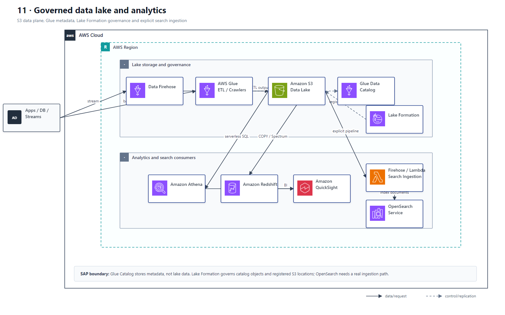

# 11 数据湖、分析与查询平台

## AWS 架构图

## 关键架构决策

| 架构需求 | 推荐设计 |
|---|---|
| S3 上直接交互式 SQL | Athena + Glue Data Catalog |
| 企业级数据湖权限 | Lake Formation + centralized governance |
| 日志/搜索分析 | OpenSearch + warm/cold tiering |
| BI 可视化 | QuickSight 读取 Athena/Redshift/CUR |

## 架构设计要点

- 分析题先看 workload：ad-hoc SQL、数仓、搜索、流式，各自对应不同服务。
- S3 往往是最便宜的数据湖底座，计算层按需选择 Athena/EMR/Redshift/OpenSearch。
- Glue Data Catalog 保存表、分区和 schema 元数据；数据仍在 S3，不能把 Catalog 画成向 S3 写“元数据文件”的存储路径。
- Lake Formation 同时治理 Catalog 对象和已注册的 S3 location；Athena 通过这些授权访问数据。
- OpenSearch 需要 Firehose、Lambda 或 ETL 等摄取路径，不能把 S3 bucket 直接画成搜索索引写入端。
