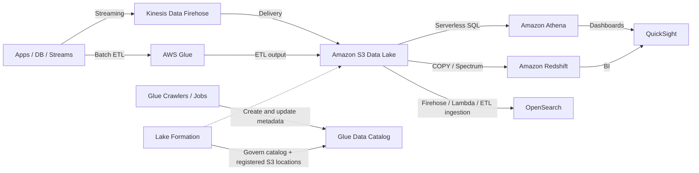

# 11 数据湖、分析与查询平台

> 系列：AWS SAP-C02 经典架构（20 场景）
>
> 架构语义已按 AWS 官方资料审计。当前工作区未包含 `aws-sap-c02-529-questions副本.md`，因此题号映射为 **NOT VERIFIED**，不应把代表题号视为已复核事实。

## AWS 架构图

可编辑源图：[11-data-lake-analytics.svg](diagrams/11-data-lake-analytics.svg)

## 核心架构

## 题库反复考的决策

| 判断问题 | 优先架构/服务 | 代表题号 |
|---|---|---|
| S3 上直接交互式 SQL | Athena + Glue Data Catalog | Q46、Q122 |
| 企业级数据湖权限 | Lake Formation + centralized governance | Q281、Q510 |
| 日志/搜索分析 | OpenSearch + warm/cold tiering | Q43、Q252 |
| BI 可视化 | QuickSight 读取 Athena/Redshift/CUR | Q79、Q196、Q484 |

## 架构审计要点

- 分析题先看 workload：ad-hoc SQL、数仓、搜索、流式，各自对应不同服务。
- S3 往往是最便宜的数据湖底座，计算层按需选择 Athena/EMR/Redshift/OpenSearch。
- Glue Data Catalog 保存表、分区和 schema 元数据；数据仍在 S3，不能把 Catalog 画成向 S3 写“元数据文件”的存储路径。
- Lake Formation 同时治理 Catalog 对象和已注册的 S3 location；Athena 通过这些授权访问数据。
- OpenSearch 需要 Firehose、Lambda 或 ETL 等摄取路径，不能把 S3 bucket 直接画成搜索索引写入端。

## 覆盖的代表题

Q43, Q46, Q79, Q92, Q101, Q114, Q122, Q147, Q196, Q211, Q239, Q252, Q281, Q305, Q362, Q387, Q484, Q497, Q510, Q524

---

## 系列导航

- 上一篇：[10 ECS、EKS、Fargate 容器平台](./10_ECS_EKS_Fargate_容器平台.md)
- 系列总览：[01 Organizations 多账户治理与 Landing Zone](./01_Organizations_多账户治理与_Landing_Zone.md)
- 下一篇：[12 数据库迁移、复制与现代化](./12_数据库迁移_复制与现代化.md)
