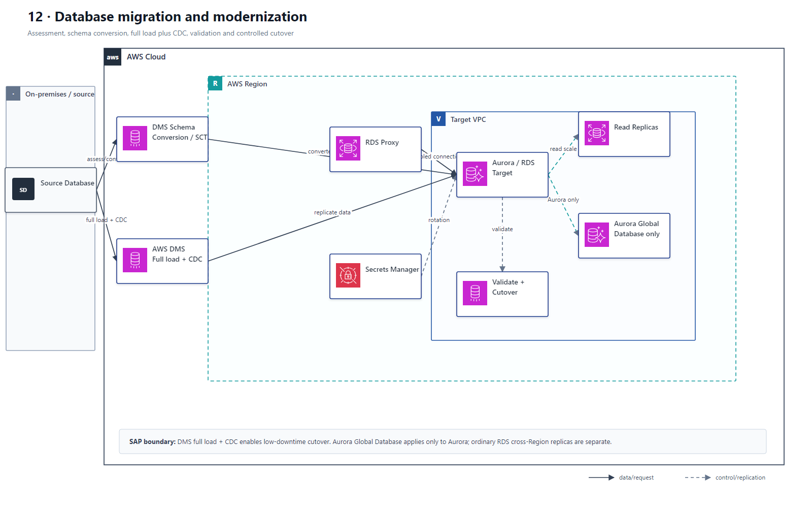

# 12 数据库迁移、复制与现代化

## AWS 架构图

## 关键架构决策

| 架构需求 | 推荐设计 |
|---|---|
| 异构数据库迁移 | SCT 转 schema + DMS full load/CDC |
| 低停机迁移 | DMS continuous replication / CDC |
| 读取扩展 | Read Replicas / Aurora Replicas |
| 跨 Region 低 RPO | Aurora Global Database / cross-Region replica |

## 架构设计要点

- Multi-AZ 不是读扩展方案；Read Replica 不是自动主库 HA 的同义词。
- 数据库迁移题先判断同构/异构、允许停机时间、数据量和网络带宽。
- 低停机迁移通常使用 DMS full load + CDC，验证目标后再切换写流量。
- 新设计优先表述为 DMS Schema Conversion；AWS SCT 仍可能作为历史工具或旧版资料中出现。
- Aurora Global Database 只适用于 Aurora；普通 RDS 跨 Region read replica 是另一条设计路径。
