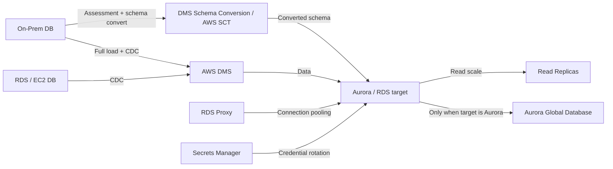

# 12 数据库迁移、复制与现代化

> 系列：AWS SAP-C02 经典架构（20 场景）
>
> 架构语义已按 AWS 官方资料审计。当前工作区未包含 `aws-sap-c02-529-questions副本.md`，因此题号映射为 **NOT VERIFIED**，不应把代表题号视为已复核事实。

## AWS 架构图

可编辑源图：[12-database-migration.svg](diagrams/12-database-migration.svg)

## 核心架构

## 题库反复考的决策

| 判断问题 | 优先架构/服务 | 代表题号 |
|---|---|---|
| 异构数据库迁移 | SCT 转 schema + DMS full load/CDC | Q72、Q229、Q315 |
| 低停机迁移 | DMS continuous replication / CDC | Q148、Q202 |
| 读取扩展 | Read Replicas / Aurora Replicas | Q37、Q125 |
| 跨 Region 低 RPO | Aurora Global Database / cross-Region replica | Q296、Q298、Q390 |

## 架构审计要点

- Multi-AZ 不是读扩展方案；Read Replica 不是自动主库 HA 的同义词。
- 数据库迁移题先判断同构/异构、允许停机时间、数据量和网络带宽。
- 低停机迁移通常使用 DMS full load + CDC，验证目标后再切换写流量。
- 新设计优先表述为 DMS Schema Conversion；AWS SCT 仍可能作为历史工具或题库术语出现。
- Aurora Global Database 只适用于 Aurora；普通 RDS 跨 Region read replica 是另一条设计路径。

## 覆盖的代表题

Q37, Q48, Q50, Q72, Q80, Q81, Q125, Q135, Q148, Q202, Q207, Q229, Q272, Q275, Q296, Q298, Q312, Q315, Q335, Q341, Q374, Q390, Q395, Q424, Q452, Q477, Q481, Q497, Q502

---

## 系列导航

- 上一篇：[11 数据湖、分析与查询平台](./11_数据湖_分析与查询平台.md)
- 系列总览：[01 Organizations 多账户治理与 Landing Zone](./01_Organizations_多账户治理与_Landing_Zone.md)
- 下一篇：[13 文件存储与大规模数据迁移](./13_文件存储与大规模数据迁移.md)
