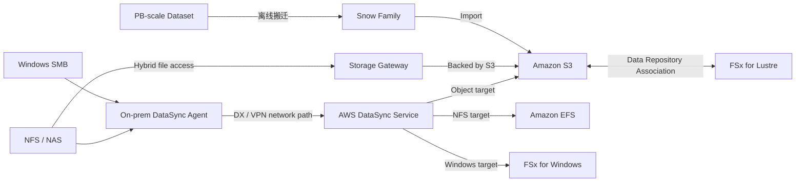

# 13 文件存储与大规模数据迁移

> 系列：AWS SAP-C02 经典架构（20 场景）
>
> 架构语义已按 AWS 官方资料审计。当前工作区未包含 `aws-sap-c02-529-questions副本.md`，因此题号映射为 **NOT VERIFIED**，不应把代表题号视为已复核事实。

## AWS 架构图

可编辑源图：[13-file-data-migration.svg](diagrams/13-file-data-migration.svg)

## 核心架构

## 题库反复考的决策

| 判断问题 | 优先架构/服务 | 代表题号 |
|---|---|---|
| Windows 文件服务器 → AWS 文件系统 | DataSync → FSx for Windows | Q35 |
| 持续混合文件访问 | Storage Gateway File Gateway | Q62、Q231 |
| 网络搬不动的大数据 | Snow Family | Q93、Q138、Q203 |
| 周期 HPC 高性能共享文件 | S3 + 临时 FSx for Lustre | Q23 |

## 架构审计要点

- DataSync 是迁移/同步工具；Storage Gateway 是持续混合访问服务，两者用途不同。
- Windows SMB 兼容通常看 FSx for Windows File Server，而不是 EFS。
- On-prem 到 AWS 的 DataSync 需要部署 DataSync Agent，并通过 Internet、VPN 或 Direct Connect 到达服务 endpoint。
- FSx for Lustre 与 S3 的集成应标明 Data Repository Association，可按需导入和导出对象，而不是笼统称为一次性“高性能导入”。

## 覆盖的代表题

Q23, Q35, Q62, Q93, Q102, Q138, Q165, Q193, Q203, Q231, Q234, Q302, Q331, Q359, Q369, Q389, Q393, Q420, Q425, Q429, Q448, Q449, Q457, Q494

---

## 系列导航

- 上一篇：[12 数据库迁移、复制与现代化](./12_数据库迁移_复制与现代化.md)
- 系列总览：[01 Organizations 多账户治理与 Landing Zone](./01_Organizations_多账户治理与_Landing_Zone.md)
- 下一篇：[14 HPC、Batch、FSx for Lustre 与 Spot](./14_HPC_Batch_FSx_for_Lustre_与_Spot.md)
