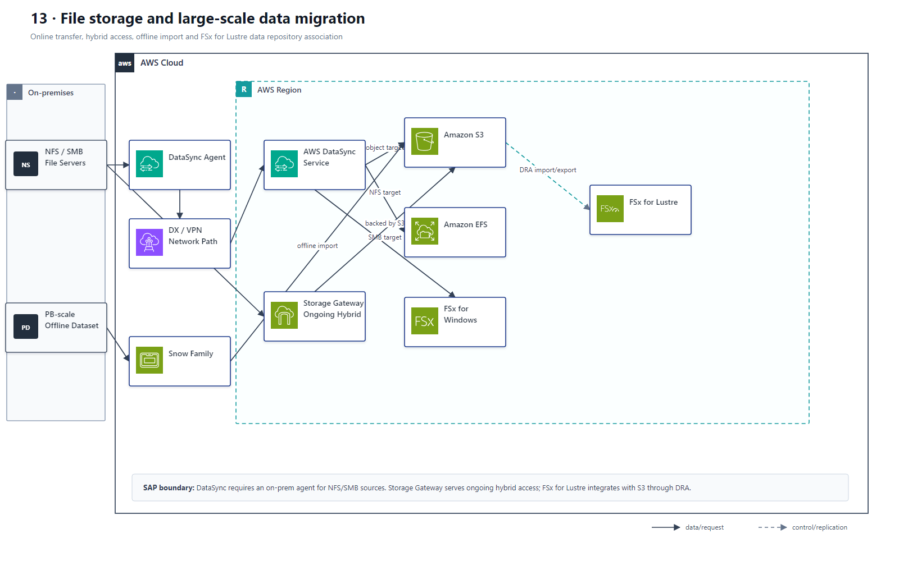

# 13 文件存储与大规模数据迁移

## AWS 架构图

## 关键架构决策

| 架构需求 | 推荐设计 |
|---|---|
| Windows 文件服务器 → AWS 文件系统 | DataSync → FSx for Windows |
| 持续混合文件访问 | Storage Gateway File Gateway |
| 网络搬不动的大数据 | Snow Family |
| 周期 HPC 高性能共享文件 | S3 + 临时 FSx for Lustre |

## 架构设计要点

- DataSync 是迁移/同步工具；Storage Gateway 是持续混合访问服务，两者用途不同。
- Windows SMB 兼容通常看 FSx for Windows File Server，而不是 EFS。
- On-prem 到 AWS 的 DataSync 需要部署 DataSync Agent，并通过 Internet、VPN 或 Direct Connect 到达服务 endpoint。
- FSx for Lustre 与 S3 的集成应标明 Data Repository Association，可按需导入和导出对象，而不是笼统称为一次性“高性能导入”。
