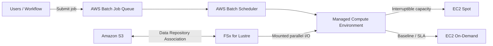

# 14 HPC、Batch、FSx for Lustre 与 Spot

> 系列：AWS SAP-C02 经典架构（20 场景）
>
> 架构语义已按 AWS 官方资料审计。当前工作区未包含 `aws-sap-c02-529-questions副本.md`，因此题号映射为 **NOT VERIFIED**，不应把代表题号视为已复核事实。

## AWS 架构图

可编辑源图：[14-hpc-batch.svg](diagrams/14-hpc-batch.svg)

## 核心架构

## 题库反复考的决策

| 判断问题 | 优先架构/服务 | 代表题号 |
|---|---|---|
| 月度 72h 高性能共享存储 | S3 长期保存 + 临时 FSx for Lustre | Q23 |
| 可中断批处理 | Spot；关键 SLA 基线用 On-Demand/Capacity Reservation | Q25、Q170 |
| 队列驱动计算 | SQS backlog → Auto Scaling / AWS Batch | Q42、Q134 |
| 成本优化同时保 SLA | 混合购买模型而不是全 Spot | Q25、Q513 |

## 架构审计要点

- Spot 适合容错/可重试 workload；紧 SLA 的最低基线需要更可靠的容量。
- FSx for Lustre 适合并行高吞吐计算，不是长期最便宜的归档介质。
- AWS Batch 自带 Job Queue、Scheduler 与 Compute Environment；只有外部业务确实需要缓冲时才额外引入 SQS。
- Capacity Reservation 解决指定 AZ 的容量保证，不等于价格折扣；折扣需要 Savings Plans/RI 等独立采购机制。

## 覆盖的代表题

Q23, Q25, Q42, Q134, Q152, Q170, Q195, Q225, Q235, Q263, Q291, Q336, Q341, Q416, Q456, Q484, Q513

---

## 系列导航

- 上一篇：[13 文件存储与大规模数据迁移](./13_文件存储与大规模数据迁移.md)
- 系列总览：[01 Organizations 多账户治理与 Landing Zone](./01_Organizations_多账户治理与_Landing_Zone.md)
- 下一篇：[15 安全基线、检测与集中审计](./15_安全基线_检测与集中审计.md)
