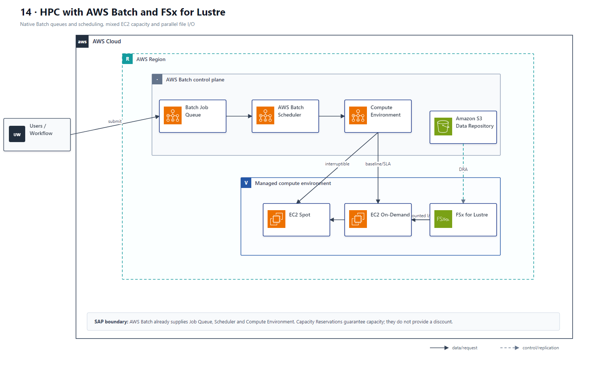

# 14 HPC、Batch、FSx for Lustre 与 Spot

## AWS 架构图

## 关键架构决策

| 架构需求 | 推荐设计 |
|---|---|
| 月度 72h 高性能共享存储 | S3 长期保存 + 临时 FSx for Lustre |
| 可中断批处理 | Spot；关键 SLA 基线用 On-Demand/Capacity Reservation |
| 队列驱动计算 | SQS backlog → Auto Scaling / AWS Batch |
| 成本优化同时保 SLA | 混合购买模型而不是全 Spot |

## 架构设计要点

- Spot 适合容错/可重试 workload；紧 SLA 的最低基线需要更可靠的容量。
- FSx for Lustre 适合并行高吞吐计算，不是长期最便宜的归档介质。
- AWS Batch 自带 Job Queue、Scheduler 与 Compute Environment；只有外部业务确实需要缓冲时才额外引入 SQS。
- Capacity Reservation 解决指定 AZ 的容量保证，不等于价格折扣；折扣需要 Savings Plans/RI 等独立采购机制。
