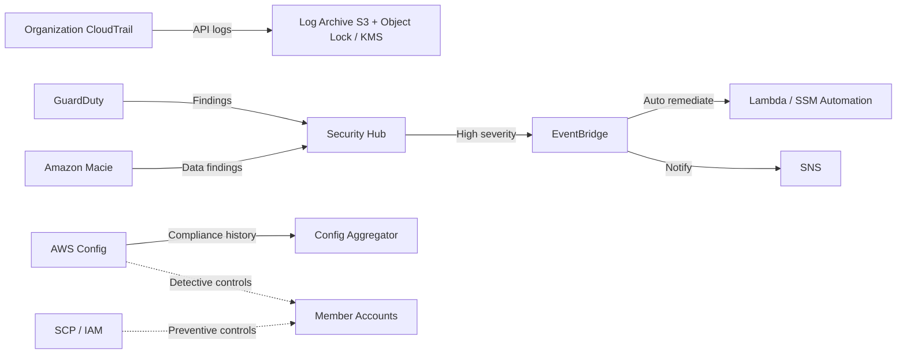

# 15 安全基线、检测与集中审计

> 系列：AWS SAP-C02 经典架构（20 场景）
>
> 架构语义已按 AWS 官方资料审计。当前工作区未包含 `aws-sap-c02-529-questions副本.md`，因此题号映射为 **NOT VERIFIED**，不应把代表题号视为已复核事实。

## AWS 架构图

可编辑源图：[15-security-governance.svg](diagrams/15-security-governance.svg)

## 核心架构

## 题库反复考的决策

| 判断问题 | 优先架构/服务 | 代表题号 |
|---|---|---|
| 组织级审计 | Organization CloudTrail → central log archive | Q117、Q118、Q370 |
| 持续配置合规 | AWS Config rules / aggregators | Q44、Q110、Q418 |
| 威胁检测与统一视图 | GuardDuty + Security Hub | Q199、Q299、Q419、Q488 |
| 自动修复 | EventBridge → Lambda/SSM Automation | Q173、Q197、Q262 |

## 架构审计要点

- Preventive control（SCP/IAM）和 detective control（Config/GuardDuty）是两层，不要互相替代。
- 安全题看到“所有账户、集中审计、不可篡改”时，通常要独立 Log Archive/Security account + KMS + least privilege。
- CloudTrail 原始日志归档到 S3；GuardDuty、Macie 等服务的 findings 才聚合到 Security Hub。
- Config 的中心视图是组织 aggregator。Security Hub 可消费部分 Config/合规信号，但两者不能画成单一日志管道。
- WAF/Shield 负责边缘防护；除非题目明确某个 findings 集成，不要笼统画成把原始“edge signals”直接送入 Security Hub。

## 覆盖的代表题

Q44, Q57, Q90, Q91, Q97, Q101, Q110, Q111, Q113, Q117, Q118, Q159, Q167, Q173, Q183, Q189, Q197, Q199, Q205, Q210, Q217, Q219, Q242, Q251, Q256, Q260, Q262, Q270, Q299, Q301, Q306, Q321, Q357, Q362, Q370, Q381, Q388, Q417, Q418, Q419, Q427, Q478, Q488, Q500, Q520

---

## 系列导航

- 上一篇：[14 HPC、Batch、FSx for Lustre 与 Spot](./14_HPC_Batch_FSx_for_Lustre_与_Spot.md)
- 系列总览：[01 Organizations 多账户治理与 Landing Zone](./01_Organizations_多账户治理与_Landing_Zone.md)
- 下一篇：[16 身份联合、IAM Identity Center 与跨账户访问](./16_身份联合_IAM_Identity_Center_与跨账户访问.md)
