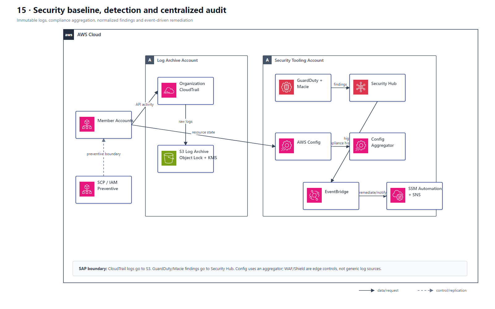

# 15 安全基线、检测与集中审计

## AWS 架构图

## 关键架构决策

| 架构需求 | 推荐设计 |
|---|---|
| 组织级审计 | Organization CloudTrail → central log archive |
| 持续配置合规 | AWS Config rules / aggregators |
| 威胁检测与统一视图 | GuardDuty + Security Hub |
| 自动修复 | EventBridge → Lambda/SSM Automation |

## 架构设计要点

- Preventive control（SCP/IAM）和 detective control（Config/GuardDuty）是两层，不要互相替代。
- 安全题看到“所有账户、集中审计、不可篡改”时，通常要独立 Log Archive/Security account + KMS + least privilege。
- CloudTrail 原始日志归档到 S3；GuardDuty、Macie 等服务的 findings 才聚合到 Security Hub。
- Config 的中心视图是组织 aggregator。Security Hub 可消费部分 Config/合规信号，但两者不能画成单一日志管道。
- WAF/Shield 负责边缘防护；除非目标服务明确支持相应的 findings 集成，不要笼统画成把原始“edge signals”直接送入 Security Hub。
