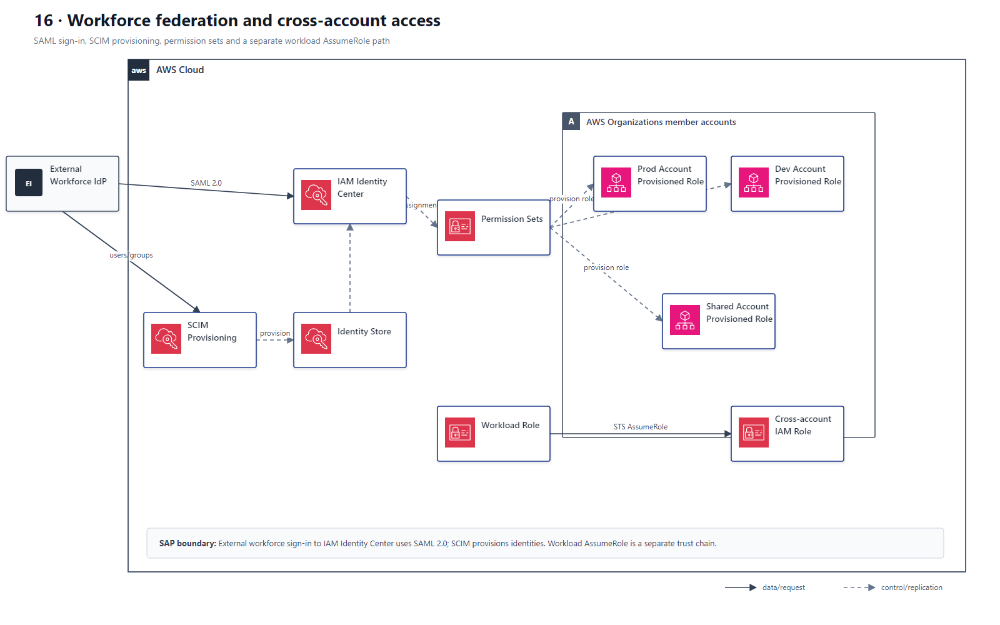

# 16 身份联合、IAM Identity Center 与跨账户访问

## AWS 架构图

## 关键架构决策

| 架构需求 | 推荐设计 |
|---|---|
| 沿用企业 AD 且统一管理身份 | IAM Identity Center federation + SAML/SCIM |
| 多账户人类访问 | Permission Sets 分配到 accounts/OUs |
| 应用/账户间机器访问 | AssumeRole / cross-account IAM roles |
| 最小权限属性控制 | ABAC / group-based assignments |

## 架构设计要点

- 不要为大量员工在每个 AWS account 创建 IAM users。
- 外部 workforce IdP 与 IAM Identity Center 的登录联合使用 SAML 2.0；不要把 OIDC 与该入口并列成可互换协议。
- SCIM 负责用户和组的自动 provisioning；Permission Set 会在目标账户中预置对应 IAM role，用户登录后取得角色会话。
- 工作负载之间的跨账户访问使用 STS AssumeRole，是与员工 SSO 分开的信任链。
