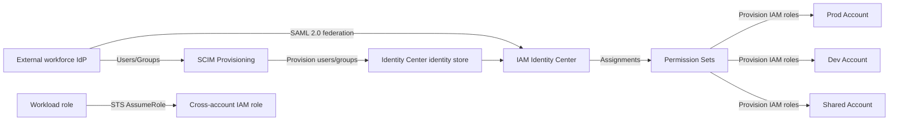

# 16 身份联合、IAM Identity Center 与跨账户访问

> 系列：AWS SAP-C02 经典架构（20 场景）
>
> 架构语义已按 AWS 官方资料审计。当前工作区未包含 `aws-sap-c02-529-questions副本.md`，因此题号映射为 **NOT VERIFIED**，不应把代表题号视为已复核事实。

## AWS 架构图

可编辑源图：[16-identity-federation.svg](diagrams/16-identity-federation.svg)

## 核心架构

## 题库反复考的决策

| 判断问题 | 优先架构/服务 | 代表题号 |
|---|---|---|
| 沿用企业 AD 且统一管理身份 | IAM Identity Center federation + SAML/SCIM | Q21、Q371 |
| 多账户人类访问 | Permission Sets 分配到 accounts/OUs | Q70、Q334 |
| 应用/账户间机器访问 | AssumeRole / cross-account IAM roles | Q200、Q402 |
| 最小权限属性控制 | ABAC / group-based assignments | Q21、Q261、Q510 |

## 架构审计要点

- 不要为大量员工在每个 AWS account 创建 IAM users。
- 外部 workforce IdP 与 IAM Identity Center 的登录联合使用 SAML 2.0；不要把 OIDC 与该入口并列成可互换协议。
- SCIM 负责用户和组的自动 provisioning；Permission Set 会在目标账户中预置对应 IAM role，用户登录后取得角色会话。
- 工作负载之间的跨账户访问使用 STS AssumeRole，是与员工 SSO 分开的信任链。

## 覆盖的代表题

Q21, Q70, Q118, Q200, Q258, Q261, Q319, Q334, Q371, Q385, Q402, Q411, Q510, Q517

---

## 系列导航

- 上一篇：[15 安全基线、检测与集中审计](./15_安全基线_检测与集中审计.md)
- 系列总览：[01 Organizations 多账户治理与 Landing Zone](./01_Organizations_多账户治理与_Landing_Zone.md)
- 下一篇：[17 IaC、StackSets、Service Catalog 与自动化治理](./17_IaC_StackSets_Service_Catalog_与自动化治理.md)
