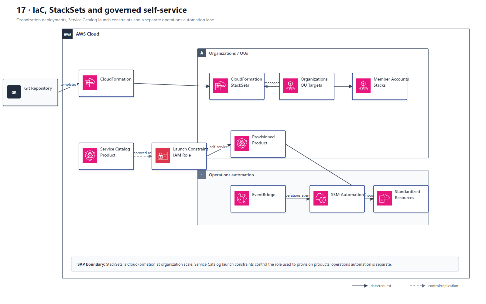

# 17 IaC、StackSets、Service Catalog 与自动化治理

## AWS 架构图

## 关键架构决策

| 架构需求 | 推荐设计 |
|---|---|
| 多账户标准化部署 | CloudFormation StackSets |
| 开发者只能部署批准模板 | Service Catalog |
| 混合服务器 patch/command | Systems Manager |
| 事件触发自动运维 | EventBridge + Lambda/SSM Automation |

## 架构设计要点

- StackSets 解决“同一基础设施模板部署到很多 account/Region”。
- Service Catalog 解决“自助但受控”的产品化交付，不等同于 StackSets。
- StackSets 是 CloudFormation 的组织级部署能力；service-managed permissions 可按 Organization/OU 定位，并自动覆盖新加入目标 OU 的账户。
- Service Catalog launch constraint 指定实际创建资源的 IAM role，使终端用户无需直接持有底层资源权限。
- EventBridge + Systems Manager Automation 是运营自动化 lane，不应与 IaC 发布流程混成一条不可区分的链路。
