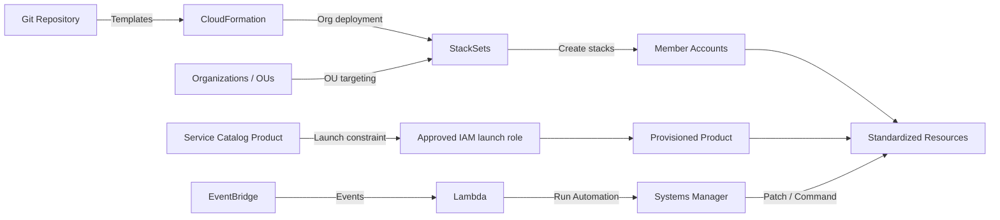

# 17 IaC、StackSets、Service Catalog 与自动化治理

> 系列：AWS SAP-C02 经典架构（20 场景）
>
> 架构语义已按 AWS 官方资料审计。当前工作区未包含 `aws-sap-c02-529-questions副本.md`，因此题号映射为 **NOT VERIFIED**，不应把代表题号视为已复核事实。

## AWS 架构图

可编辑源图：[17-iac-automation.svg](diagrams/17-iac-automation.svg)

## 核心架构

## 题库反复考的决策

| 判断问题 | 优先架构/服务 | 代表题号 |
|---|---|---|
| 多账户标准化部署 | CloudFormation StackSets | Q30、Q38、Q168、Q328、Q516 |
| 开发者只能部署批准模板 | Service Catalog | Q269、Q294、Q336、Q386 |
| 混合服务器 patch/command | Systems Manager | Q13、Q14、Q62 |
| 事件触发自动运维 | EventBridge + Lambda/SSM Automation | Q14、Q177、Q222 |

## 架构审计要点

- StackSets 解决“同一基础设施模板部署到很多 account/Region”。
- Service Catalog 解决“自助但受控”的产品化交付，不等同于 StackSets。
- StackSets 是 CloudFormation 的组织级部署能力；service-managed permissions 可按 Organization/OU 定位，并自动覆盖新加入目标 OU 的账户。
- Service Catalog launch constraint 指定实际创建资源的 IAM role，使终端用户无需直接持有底层资源权限。
- EventBridge + Systems Manager Automation 是运营自动化 lane，不应与 IaC 发布流程混成一条不可区分的链路。

## 覆盖的代表题

Q13, Q14, Q19, Q26, Q30, Q37, Q38, Q39, Q58, Q60, Q62, Q65, Q74, Q84, Q85, Q89, Q110, Q128, Q163, Q168, Q177, Q181, Q204, Q222, Q269, Q286, Q294, Q316, Q328, Q336, Q360, Q386, Q417, Q419, Q508, Q516

---

## 系列导航

- 上一篇：[16 身份联合、IAM Identity Center 与跨账户访问](./16_身份联合_IAM_Identity_Center_与跨账户访问.md)
- 系列总览：[01 Organizations 多账户治理与 Landing Zone](./01_Organizations_多账户治理与_Landing_Zone.md)
- 下一篇：[18 AWS Backup、Elastic Disaster Recovery 与迁移恢复](./18_AWS_Backup_Elastic_Disaster_Recovery_与迁移恢复.md)
