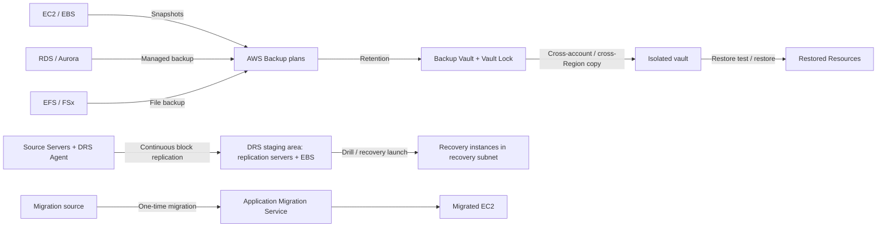

# 18 AWS Backup、Elastic Disaster Recovery 与迁移恢复

> 系列：AWS SAP-C02 经典架构（20 场景）
>
> 架构语义已按 AWS 官方资料审计。当前工作区未包含 `aws-sap-c02-529-questions副本.md`，因此题号映射为 **NOT VERIFIED**，不应把代表题号视为已复核事实。

## AWS 架构图

可编辑源图：[18-backup-dr-migration.svg](diagrams/18-backup-dr-migration.svg)

## 核心架构

## 题库反复考的决策

| 判断问题 | 优先架构/服务 | 代表题号 |
|---|---|---|
| 集中备份策略/跨账户备份 | AWS Backup + backup policies/vault | Q62、Q175、Q213 |
| 不可篡改备份 | Backup Vault Lock / retention controls | Q238、Q337 |
| 服务器级低 RPO/RTO DR | Elastic Disaster Recovery | Q169、Q171、Q202、Q429、Q448 |
| 迁移到 AWS | Application Migration Service / DRS 类连续复制 | Q234、Q439 |

## 架构审计要点

- Backup/Restore 与 DRS 是不同恢复模式：前者更便宜但 RTO 通常更长；后者持续块级复制，恢复更快。
- 先读题目要求的 RPO/RTO，再决定是否值得保持 warm/pilot resources。
- AWS Backup 的核心链路是 plan → vault → cross-account/cross-Region copy → restore；Vault Lock 提供合规保留保护。
- DRS 使用 agent 把块数据持续复制到低成本 staging area，演练或故障时才在 recovery subnet 启动 recovery instances。
- AWS MGN 是迁移服务，DRS 是持续灾难恢复服务；两条 lane 不应混画成同一种恢复能力。

## 覆盖的代表题

Q62, Q76, Q102, Q148, Q160, Q169, Q171, Q175, Q193, Q202, Q204, Q213, Q231, Q234, Q238, Q296, Q298, Q308, Q310, Q333, Q337, Q350, Q359, Q375, Q389, Q429, Q439, Q448, Q453, Q494

---

## 系列导航

- 上一篇：[17 IaC、StackSets、Service Catalog 与自动化治理](./17_IaC_StackSets_Service_Catalog_与自动化治理.md)
- 系列总览：[01 Organizations 多账户治理与 Landing Zone](./01_Organizations_多账户治理与_Landing_Zone.md)
- 下一篇：[19 成本优化、容量采购与 FinOps](./19_成本优化_容量采购_与_FinOps.md)
