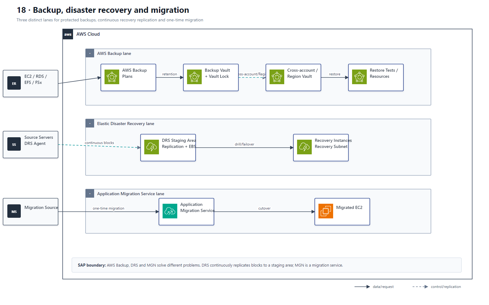

# 18 AWS Backup、Elastic Disaster Recovery 与迁移恢复

## AWS 架构图

## 关键架构决策

| 架构需求 | 推荐设计 |
|---|---|
| 集中备份策略/跨账户备份 | AWS Backup + backup policies/vault |
| 不可篡改备份 | Backup Vault Lock / retention controls |
| 服务器级低 RPO/RTO DR | Elastic Disaster Recovery |
| 迁移到 AWS | Application Migration Service / DRS 类连续复制 |

## 架构设计要点

- Backup/Restore 与 DRS 是不同恢复模式：前者更便宜但 RTO 通常更长；后者持续块级复制，恢复更快。
- 先根据业务 RPO/RTO 决定是否值得持续保留 warm standby 或 pilot-light 资源。
- AWS Backup 的核心链路是 plan → vault → cross-account/cross-Region copy → restore；Vault Lock 提供合规保留保护。
- DRS 使用 agent 把块数据持续复制到低成本 staging area，演练或故障时才在 recovery subnet 启动 recovery instances。
- AWS MGN 是迁移服务，DRS 是持续灾难恢复服务；两条 lane 不应混画成同一种恢复能力。
