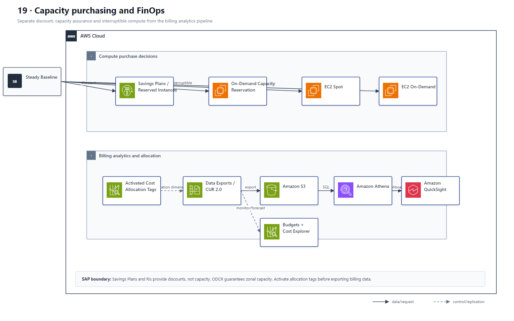
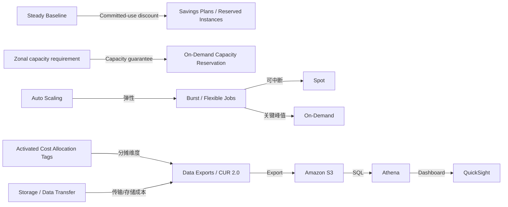

# 19 成本优化、容量采购与 FinOps

> 系列：AWS SAP-C02 经典架构（20 场景）
>
> 架构语义已按 AWS 官方资料审计。当前工作区未包含 `aws-sap-c02-529-questions副本.md`，因此题号映射为 **NOT VERIFIED**，不应把代表题号视为已复核事实。

## AWS 架构图

可编辑源图：[19-cost-finops.svg](diagrams/19-cost-finops.svg)

## 核心架构

## 题库反复考的决策

| 判断问题 | 优先架构/服务 | 代表题号 |
|---|---|---|
| 稳定长期基线 | Savings Plans / Reserved Capacity | Q41、Q170 |
| 可重试弹性任务 | Spot + Auto Scaling | Q25、Q152、Q291 |
| 关键 SLA 容量保证 | On-Demand Capacity Reservations | Q25 |
| 组织成本拆分 | 启用 cost allocation tags + CUR + Athena/QuickSight | Q29、Q34、Q79、Q484 |

## 架构审计要点

- 题目说“no long-term commitments”时不要选 Savings Plans/RI。
- Spot 节省最多，但必须结合中断容忍度和 SLA 判断。
- Savings Plans/RI 提供使用折扣，不提供容量保证；ODCR 提供指定 AZ 的 EC2 容量，符合条件的 Savings Plans 折扣可另行应用于其用量。
- 成本标签必须激活后才进入账单维度；明细分析链路应是 Data Exports/CUR → S3 → Athena/QuickSight。

## 覆盖的代表题

Q25, Q29, Q34, Q41, Q79, Q83, Q88, Q152, Q170, Q225, Q226, Q240, Q245, Q263, Q291, Q294, Q336, Q341, Q416, Q450, Q484, Q513, Q528

---

## 系列导航

- 上一篇：[18 AWS Backup、Elastic Disaster Recovery 与迁移恢复](./18_AWS_Backup_Elastic_Disaster_Recovery_与迁移恢复.md)
- 系列总览：[01 Organizations 多账户治理与 Landing Zone](./01_Organizations_多账户治理与_Landing_Zone.md)
- 下一篇：[20 运维可观测性、自动修复与 Patch](./20_运维可观测性_自动修复与_Patch.md)
