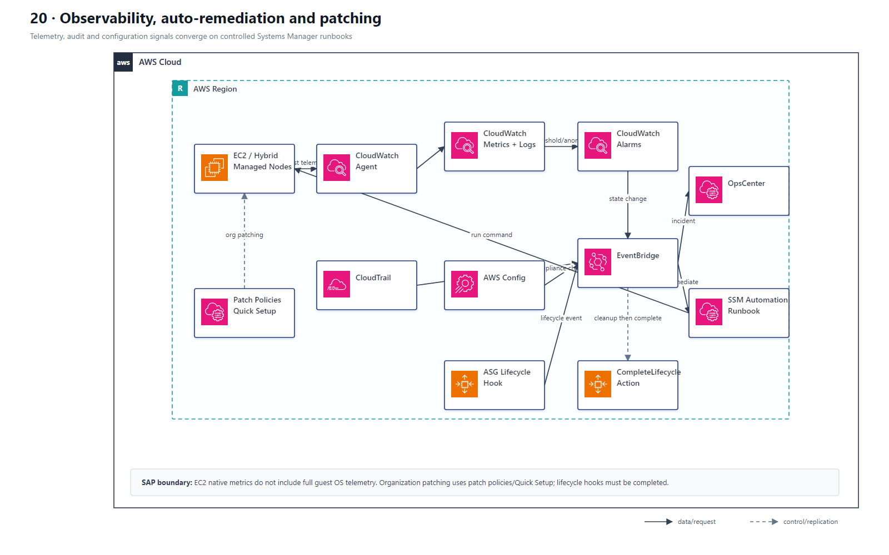
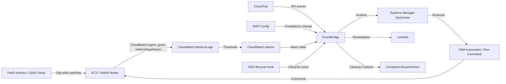

# 20 运维可观测性、自动修复与 Patch

> 系列：AWS SAP-C02 经典架构（20 场景）
>
> 架构语义已按 AWS 官方资料审计。当前工作区未包含 `aws-sap-c02-529-questions副本.md`，因此题号映射为 **NOT VERIFIED**，不应把代表题号视为已复核事实。

## AWS 架构图

可编辑源图：[20-operations-observability.svg](diagrams/20-operations-observability.svg)

## 核心架构

## 题库反复考的决策

| 判断问题 | 优先架构/服务 | 代表题号 |
|---|---|---|
| 混合服务器统一 patch 报告 | Systems Manager Patch Manager / compliance | Q13 |
| ASG 终止前执行动作 | Lifecycle Hook + EventBridge + Lambda + SSM SendCommand | Q14 |
| 自动修复配置偏差 | Config/EventBridge → SSM Automation/Lambda | Q110、Q173、Q262 |
| 集中运维事件 | CloudWatch + OpsCenter / EventBridge | Q130、Q475 |

## 架构审计要点

- CloudWatch 是运行时 telemetry；CloudTrail 是 API audit；Config 是资源配置历史/合规。
- Auto Scaling lifecycle hook 可以在 terminate 前留出时间执行日志归档等清理动作。
- EC2 原生指标不包含完整 guest OS 内存、磁盘占用与应用日志；这些数据需要 CloudWatch Agent 或应用自身上报。
- 组织级 patch 优先使用 Systems Manager patch policies/Quick Setup 或 State Manager association，而不是逐台临时 Run Command。
- 生命周期清理完成后必须调用 `CompleteLifecycleAction`，否则实例会停留到 hook timeout。

## 覆盖的代表题

Q13, Q14, Q54, Q65, Q86, Q109, Q110, Q117, Q130, Q144, Q163, Q173, Q177, Q197, Q201, Q210, Q214, Q219, Q222, Q226, Q262, Q278, Q288, Q306, Q320, Q321, Q362, Q370, Q381, Q406, Q416, Q475, Q510, Q524

---

## 系列导航

- 上一篇：[19 成本优化、容量采购与 FinOps](./19_成本优化_容量采购_与_FinOps.md)
- 系列总览：[01 Organizations 多账户治理与 Landing Zone](./01_Organizations_多账户治理与_Landing_Zone.md)
